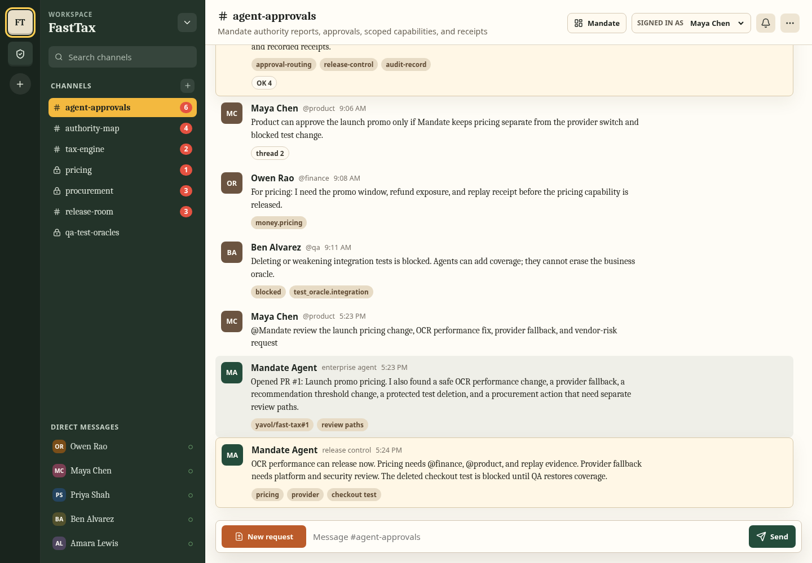
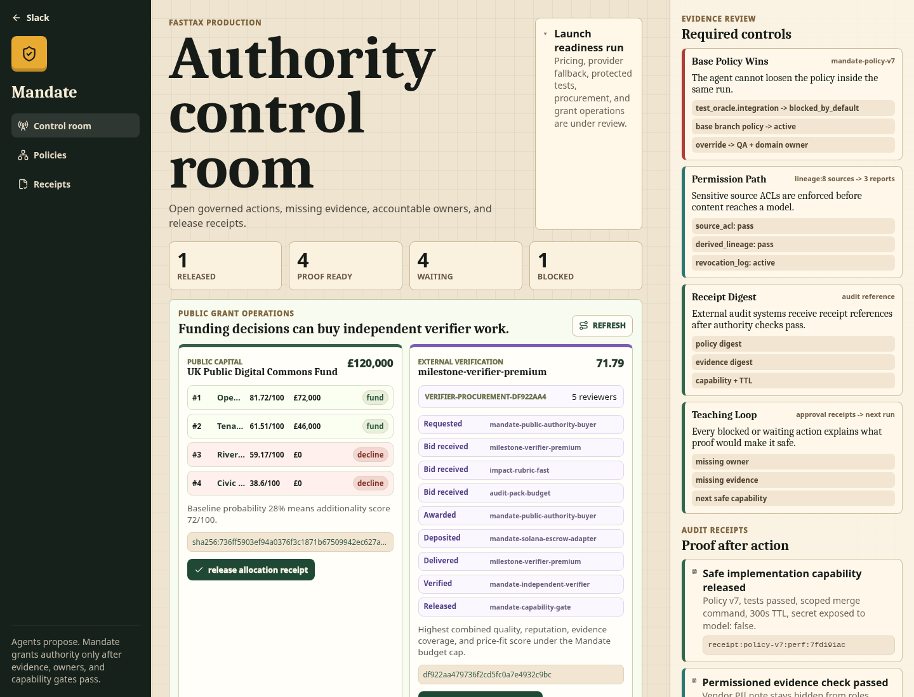
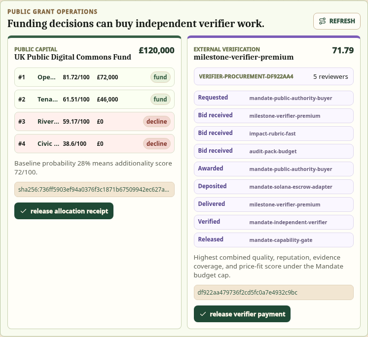

# Mandate

Mandate is built on a new and provably optimal architecture for enterprise and government AI: one logical organisation-wide agent, not a collection of per-employee bots.

Technically it can be many parallel LLM loops, tools, and specialist workers, but semantically it acts for the organisation, so it can optimise globally instead of inheriting one employee's narrow permissions and incentives.

Mandate is the control layer that makes that safe. It breaks requests into real actions such as memory access, code changes, vendor work, funding decisions, verifier payments, releases, and public receipts. Each action is checked against policy, evidence, approvals, scoped capability, and audit requirements before it can happen.

The key product idea is that refusals are useful. When Mandate blocks or waits on an action, it records what proof, owner, replay, milestone, or receipt was missing. That turns governance into a teaching signal, so future agent runs become safer, faster, and more reusable.

[Live demo](https://mandate-slack.ljoukov.workers.dev/)

[Slides](https://docs.google.com/presentation/d/1aOhdjO_dH683ssDNuktCOFDD9Cg9H05UIk7i--i2css/edit?slide=id.p#slide=id.p)


## Demo

The demo shows Mandate as one logical company or public-authority agent with many approval gates.

The Slack-style surface starts with a pre-configured workspace account, then a broad request. Mandate separates the work into safe implementation changes, pricing authority, vendor/security checks, procurement commitments, protected tests, public-funding decisions, and paid verifier work.




The control room shows the authority peel: what can release now, what is waiting, what is blocked, and what evidence would make the next action safe.



Public funding is scored with a reusable rubric, counterfactual additionality, milestone gates, anti-gaming adjustment, and appeal-ready receipts. External verifier procurement uses a request, bid, award, deposit, delivery, verification, and release ledger before payment can move.



## Product Claim

Most current agent deployments stop at a chat response, a generated plan, or a vertical workflow. Mandate is the layer that decides whether the agent is allowed to act.

```text
request
  -> proposed actions
  -> evidence pack
  -> authority layer
  -> approvers and deterministic gates
  -> scoped capability release
  -> receipt
  -> teaching signal for future runs
```

Mandate is deliberately not a wallet product, a DAO, or an autonomous-agent free-for-all. Chains and agent markets are adapters after authority passes. The organisation remains the authority boundary.

## What Mandate Governs

| Action | Authority layer | Mandate decision |
| --- | --- | --- |
| Merge a low-risk implementation fix | `implementation.performance` | Release scoped merge capability after tests |
| Change pricing | `money.pricing` | Wait for finance, product, and replay proof |
| Change a vendor/provider | `vendor.api_provider` | Wait for platform, security, and retention proof |
| Weaken a protected test | `test_oracle.integration` | Block by default |
| Submit a tender or external commitment | `commercial.external_commitment` | Require legal, delivery, and source proof |
| Read sensitive derived evidence | `evidence.permissioned_memory` | Enforce deterministic ACL and lineage before model context |
| Allocate public-good funding | `public_capital.allocation` | Require rubric, counterfactuals, milestones, and public audit |
| Pay a verifier or specialist agent | `verifier_procurement.spend` | Release only after budget, acceptance test, delivery proof, and receipt |

## Product Integrations

Mandate includes these product integrations:

| Integration | Where it appears |
| --- | --- |
| Conduct | Controlled enterprise change, human approvals, scoped capabilities, blocked unsafe actions |
| GCC & ETH | Public-funding allocation with non-gameable metrics, counterfactual reasoning, milestone verification, reusable interfaces |
| CoralOS / STUK | Verifier procurement and settlement ledger where a public authority pays only after delivery and verification |
| Fetch.ai | Action-readiness agent that answers allowed, waiting, blocked, or proof-ready |

## Public Funding And Verifier Procurement Code

The code paths below are product workflows with clear external integration points.

### GCC & ETH: Public Funding Distribution

Mandate includes a deterministic public-funding workflow for sourcing, scoring, allocating, and auditing public capital without optimizing an easy-to-game proxy:

| Requirement | Our implementation |
| --- | --- |
| Define and justify metrics | `slack/src/lib/server/publicFundingWorkflows.ts` defines weighted rubric metrics: impact, counterfactual additionality, milestone verifiability, forkable commons, governance transparency, privacy/rights fit, and anti-gaming adjustment. |
| Avoid easy-to-game proxies | The scoring code penalises `vanityProxyRisk` and combines reach with evidence confidence, unit cost, baseline probability, and delivery risk. The reach-heavy dashboard proposal is declined. |
| Make real allocation decisions | `buildFundingWorkflow()` returns ranked `FundingDecision` objects with `fund`, `reserve`, or `decline`, award amounts, rationale, required approvals, and receipt hashes. |
| Verify milestones | Each `GrantApplication` has `GrantMilestone` entries with evidence requirements and release percentages. |
| Reusable components | `/api/public-funding/verifier-procurement` exposes the full workflow JSON for reuse by other grant programmes. |
| Audit / public receipt | `agent/src/public-funding-verifier-procurement.ts` creates an ETH-compatible encoded attestation payload and writes `agent/output/public-funding-verifier-procurement.json`. |

Code pointers:

- `slack/src/lib/server/publicFundingWorkflows.ts`
- `slack/src/routes/api/public-funding/verifier-procurement/+server.ts`
- `slack/src/routes/api/capability/release/+server.ts` for `allocate.public_funding`
- `agent/src/public-funding-verifier-procurement.ts`
- `agent/output/public-funding-verifier-procurement.json`

### CoralOS / STUK: Verifier Procurement

Mandate models specialist verifier procurement as a governed purchase before grant money can be released:

| Requirement | Our implementation |
| --- | --- |
| Procurement loop | `buildVerifierProcurementWorkflow()` models request, bid, award, deposit, delivery, verification, and release states. |
| Competing suppliers | The workflow creates three verifier bids with price, quality, reputation, delivery time, and evidence coverage. |
| Award logic | Bid scoring combines quality, reputation, price fit, and delivery speed under a budget cap. |
| Settlement intent | The selected verifier gets a devnet escrow reference and amount in `verifierProcurement.escrow`. |
| Verification before release | The ledger includes delivered and verified states before release. |
| Mandate authority gate | `/api/capability/release` releases `pay.agent.vendor` only with `@finance`, `budget_lane`, `acceptance_test`, and `delivery_proof`. |
| Receipt action | `/api/solana/action/public-funding-release` returns a hash-only receipt payload for the verifier release. |

Code pointers:

- `slack/src/lib/server/publicFundingWorkflows.ts`
- `slack/src/routes/api/solana/action/public-funding-release/+server.ts`
- `slack/src/routes/api/capability/release/+server.ts` for `pay.agent.vendor`
- `agent/src/public-funding-verifier-procurement.ts`
- `slack/src/routes/dashboard/+page.svelte` for the live control-room view

## Key Slides

These are generated PNG slides from the final deck.


## Run The Demo

```bash
cd slack
npm install
npm run dev
```

Open the printed localhost URL.

Useful routes:

| Route | Purpose |
| --- | --- |
| `/` | Slack-style request and approval flow |
| `/dashboard` | Mandate control room |
| `/api/public-funding/verifier-procurement` | Public-funding allocation and verifier-procurement workflow JSON |
| `/api/capability/release` | Capability gate used by the UI and integration workflows |
| `/api/solana/action/mandate-receipt` | Hash-only Mandate receipt action |
| `/api/solana/action/public-funding-release` | Hash-only public-funding verifier release receipt action |

## Generate Evidence Artifacts

```bash
cd agent
npm install
npm run fast-tax:evidence
npm run public-funding:verifier-procurement
python3 -m py_compile fetch_action_readiness_agent.py
```

Generated artifacts:

| File | Contents |
| --- | --- |
| `agent/output/mandate-run-42.json` | FastTax authority evidence |
| `agent/output/public-funding-verifier-procurement.json` | Public-funding allocation decisions, verifier procurement ledger, receipt action metadata |

## Design Rules

- The requester starts work; the organisation grants authority.
- Mandate releases verbs, not secrets: `merge.money.pricing`, `allocate.public_funding`, `pay.agent.vendor`.
- No LLM decides final permission. Permission is deterministic at the gate.
- Evidence can be private; receipts should be hash-only and audit-ready.
- A blocked or waiting action must explain the next safe step.
- External commitments, payments, dispatches, and public-funding decisions are actions, not just generated text.
- Chain rails attest after Mandate decides; they do not decide authority.
